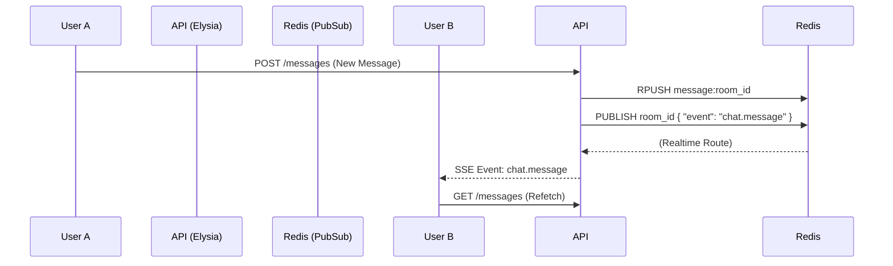

# 🛰️ 10MinChatApp - Private, Ephemeral Chat

A high-performance, private chat application where rooms and messages vanish after 10 minutes. Built with a modern edge-ready stack focusing on speed and simplicity.


---

## 📂 Repository Structure

| Path | Description |
| :--- | :--- |
| **`src/app/`** | Next.js App Router root |
| `src/app/page.tsx` | Lobby page for room creation and status notifications |
| `src/app/room/[roomId]/page.tsx` | Main chat interface with countdown timer and message list |
| `src/app/api/[[...slugs]]/route.ts` | **Elysia API Server** handling rooms and messages |
| `src/app/api/[[...slugs]]/auth.ts` | Auth middleware for room-specific sessions |
| `src/app/api/realtime/route.ts` | Realtime event stream (Server-Sent Events) |
| **`src/lib/`** | Core utilities and singleton clients |
| `src/lib/client.ts` | **Eden Treaty** client for type-safe API calls |
| `src/lib/redis.ts` | Upstash Redis connection |
| `src/lib/realtime.ts` | Server-side PubSub logic |
| `src/lib/realtime-client.ts` | Frontend hook for subscribing to room events |
| **`src/hooks/`** | Custom React hooks |
| `src/hooks/use-username.ts` | Persisted username management |

---

## ⚙️ Way of Working (Logic Flow)

### 1. Room Creation & TTL
- **Action**: User clicks "Create Room".
- **Backend**: `/room/create` generates a unique `roomId`, initializes metadata in Redis, and sets a **10-minute expiry (TTL)** on the key.
- **Expiry**: When the Redis `meta` key expires, the room is considered "dead".

### 2. Messaging & Persistence
- **Flow**: User sends message -> Elysia API.
- **Storage**: Messages are stored in a Redis list (`message:{roomId}`).
- **Synchronization**: Every message update triggers a `redis.expire` call on the message list and user set, keeping them in sync with the room's remaining life.

### 3. Realtime Updates


### 4. Destruction
- **Manual**: Clicking "Destroy Now" triggers a manual cleanup of all Redis keys associated with the room.
- **Automatic**: Once the TTL hits 0, the room metadata vanishes. The frontend detects this via the `ttl` query and redirects users to the lobby.

---

## 🚀 Getting Started

1. **Clone the repo**
2. **Install dependencies**: `npm install`
3. **Environment Setup**: Create a `.env` file with your Redis credentials:
   ```env
   UPSTASH_REDIS_REST_URL=your_url
   UPSTASH_REDIS_REST_TOKEN=your_token
   ```
4. **Run Dev Server**: `npm run dev`

---

> [!IMPORTANT]
> **Privacy Note**: We do not store logs. Once a room is destroyed or expires, all messages are permanently deleted from the Redis instance.
